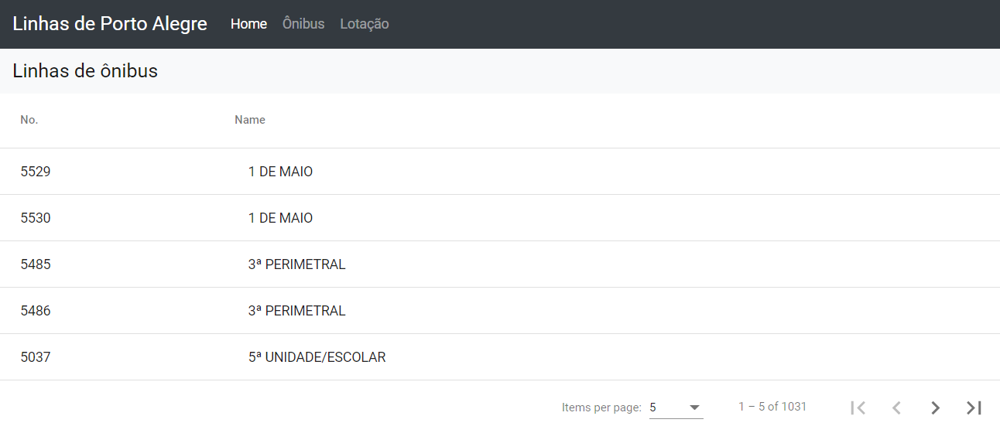

<p align="center">
  <a href="#-projeto">Projeto</a> |
  <a href="#-tecnologias">Tecnologias</a> |
  <a href="#-prints">Prints</a> |
  <a href="#-instalação">Instalação</a>   |
</p>

<br>

### Projeto

Aplicação simples feita com Angular 10, faz consultas em APIS de linhas de ônibus e lotação de Porto Alegre, abrindo no Google Maps a localização de itinerários.

### Tecnologias 🚀

* [Angular](https://angular.io/)
* [Angular Material](https://material.angular.io/)
* [Bootstrap](https://getbootstrap.com/)

### Prints

##### Home


##### Linhas de ônibus



###  Instalação 📀

Clone este repositório:

```bash
git clone https://github.com/IsJordanBraz/transporte-poa-frontend.git
```

Entre na pasta do projeto:

```bash
cd transport-poa-frontend
```

Para instalar todas as depêndencias, execute o comando:

```bash
npm install
```

Iniciar o projeto.

```bash
ng serve
```
